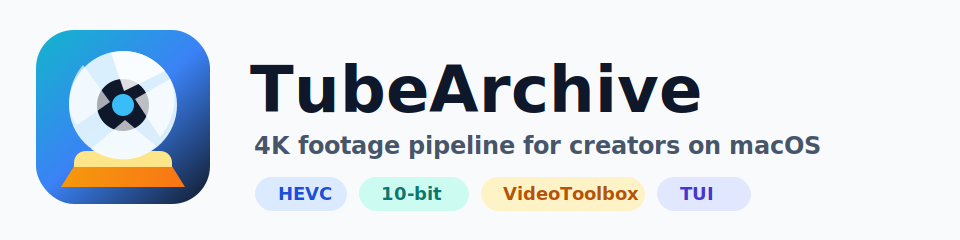
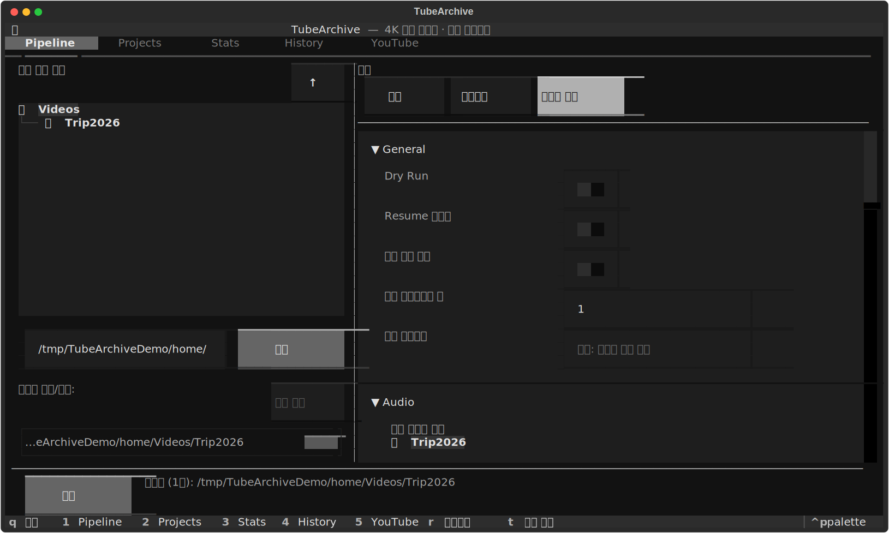
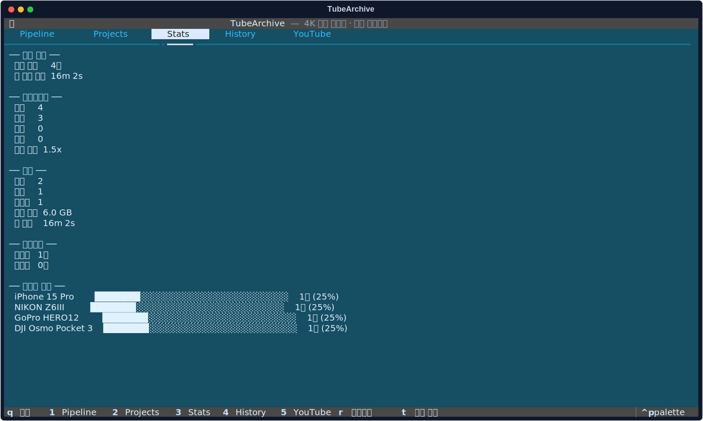

<p align="center">
  
</p>

<h1 align="center">TubeArchive</h1>

<p align="center">
  <a href="README.md">한국어</a> | <a href="README.en.md">English</a> | 日本語
</p>

[](https://github.com/dizy64/tubearchive/actions/workflows/ci.yml)

**TubeArchive** は、Nikon、GoPro、DJI、iPhone など複数のカメラで撮影した 4K 映像を macOS 上で HEVC 10-bit に統一し、結合、補正、YouTube アップロードまで扱う動画アーカイブツールです。

繰り返し作業は CLI で自動化でき、TUI ダッシュボードではファイル選択、オプション調整、処理状況確認をターミナル上の一画面で行えます。

```bash
# インタラクティブなダッシュボード
tubearchive tui ~/Videos/Trip2026/

# CLI で自動結合
tubearchive ~/Videos/Trip2026/ --normalize-audio --thumbnail
```

## TUI プレビュー

<p align="center">
  
</p>

<p align="center">
  
</p>

TUI には、ファイルブラウザ、外部音声選択、エンコード設定、プリセット、プロジェクト、統計、履歴、YouTube タブがあります。ローカルサーバーは不要で、`tubearchive tui` だけでターミナルから起動できます。

## 主な機能

- **インタラクティブ TUI**: ファイル選択、オプション調整、プリセット、進捗表示、プロジェクト/統計/履歴確認。
- **スマートスキャン**: 現在のディレクトリ、指定ファイル、ディレクトリ入力に対応。
- **縦動画レイアウト**: ぼかした背景と中央の前景で縦動画を自動整形。
- **Resume 機能**: SQLite によるジョブ追跡と中断後の再開。
- **VideoToolbox 高速化**: Apple Silicon Mac で高速な HEVC エンコード。
- **デバイス検出**: Nikon N-Log、iPhone、GoPro、DJI、その他の入力を自動判定。
- **連続シーケンス結合**: GoPro/DJI の分割ファイルを 1 つの撮影単位として扱う。
- **音声処理**: EBU R128 ラウドネス正規化、ノイズ除去、無音トリミング、BGM ミックス、外部マイク同期。
- **映像処理**: 手ぶれ補正、LUT カラーグレーディング、タイムラプス、分割、サムネイル生成。
- **YouTube ワークフロー**: OAuth アップロード、チャプター、プレイリスト、サムネイル指定。
- **プロジェクト履歴**: 結合ジョブ、アップロード、アーカイブ、デバイス統計を保存。

## 出力プロファイル

結合互換性のため、すべての入力は **HEVC 50 Mbps 10-bit (p010le), 29.97 fps** に統一されます。

| デバイス | 検出条件 | 出力プロファイル |
|----------|----------|------------------|
| Nikon (N-Log) | `color_transfer: arib-std-b67` / `smpte2084` | HDR-to-SDR 変換つき SDR BT.709 |
| iPhone | SDR ソースメタデータ | SDR BT.709 |
| GoPro | SDR ソースメタデータ | SDR BT.709 |
| DJI | SDR ソースメタデータ | SDR BT.709 |
| その他 | 自動検出 | SDR BT.709 |

## 必要環境

- VideoToolbox 対応の macOS 12+
- Python 3.14+
- `hevc_videotoolbox` 対応の FFmpeg 6.0+
- Python パッケージ管理用の `uv`
- DSLR/ミラーレスのカメラモデル検出には `exiftool` を推奨

## インストール

```bash
# システム依存ツール
brew install ffmpeg exiftool

# uv と Python
curl -LsSf https://astral.sh/uv/install.sh | sh
uv python install 3.14

# プロジェクト設定
git clone <repository-url>
cd tubearchive
uv sync
```

グローバル CLI としてインストールする場合:

```bash
uv tool install .
uv tool update-shell
```

## 使い方

```bash
# TUI ダッシュボードを起動
tubearchive tui ~/Videos/Trip2026/

# フォルダ内の対応動画をすべて結合
tubearchive ~/Videos/Trip2026/

# 指定ファイルを作成時刻順で結合
tubearchive video1.mp4 video2.mov video3.mts

# 実行計画だけ確認
tubearchive --dry-run ~/Videos/Trip2026/

# 音量正規化とサムネイル生成
tubearchive --normalize-audio --thumbnail ~/Videos/Trip2026/

# 外部マイク音声を使い、拍手などのピークで自動同期
tubearchive --external-audio ~/Audio/mic.wav --sync-audio-clap video.mp4

# 結合結果を YouTube にアップロード
tubearchive --upload ~/Videos/Trip2026/
```

グローバルインストールせずにリポジトリから実行する場合:

```bash
uv run tubearchive tui ~/Videos/Trip2026/
uv run tubearchive ~/Videos/Trip2026/
```

## TUI ショートカット

| キー | 操作 |
|------|------|
| `1` | Pipeline タブ |
| `2` | Projects タブ |
| `3` | Stats タブ |
| `4` | History タブ |
| `5` | YouTube タブ |
| `r` | 現在のタブを更新 |
| `t` | テーマ切り替え |
| `q` | 終了 |

## 設定

デフォルト設定ファイルを作成:

```bash
tubearchive --init-config
```

TubeArchive は `~/.tubearchive/config.toml` を読み込みます。優先順位は次の通りです。

```text
CLI オプション > 環境変数 > config.toml > デフォルト値
```

よく使う環境変数:

| 変数 | 用途 |
|------|------|
| `TUBEARCHIVE_OUTPUT_DIR` | デフォルト出力ディレクトリ |
| `TUBEARCHIVE_DB_PATH` | SQLite データベースパス |
| `TUBEARCHIVE_PARALLEL` | 並列トランスコード数 |
| `TUBEARCHIVE_NORMALIZE_AUDIO` | ラウドネス正規化を有効化 |
| `TUBEARCHIVE_AUTO_LUT` | デバイス別 LUT 自動適用 |
| `TUBEARCHIVE_YOUTUBE_PLAYLIST` | デフォルト YouTube プレイリスト ID |

## YouTube 設定

```bash
# 認証状態とセットアップガイドを表示
tubearchive --setup-youtube

# 結合せず既存ファイルだけアップロード
tubearchive --upload-only merged_output.mp4
```

Google Cloud の OAuth デスクトップクライアント JSON を `~/.tubearchive/client_secrets.json` に配置します。初回アップロード時にブラウザ認証が開き、トークンは `~/.tubearchive/youtube_token.json` に保存されます。

## 開発

```bash
uv run pytest tests/unit/ -v
uv run mypy tubearchive/
uv run ruff check tubearchive/ tests/
uv run ruff format --check tubearchive/ tests/
```

完全なコマンドリファレンスは韓国語版の [README.md](README.md) を参照してください。
